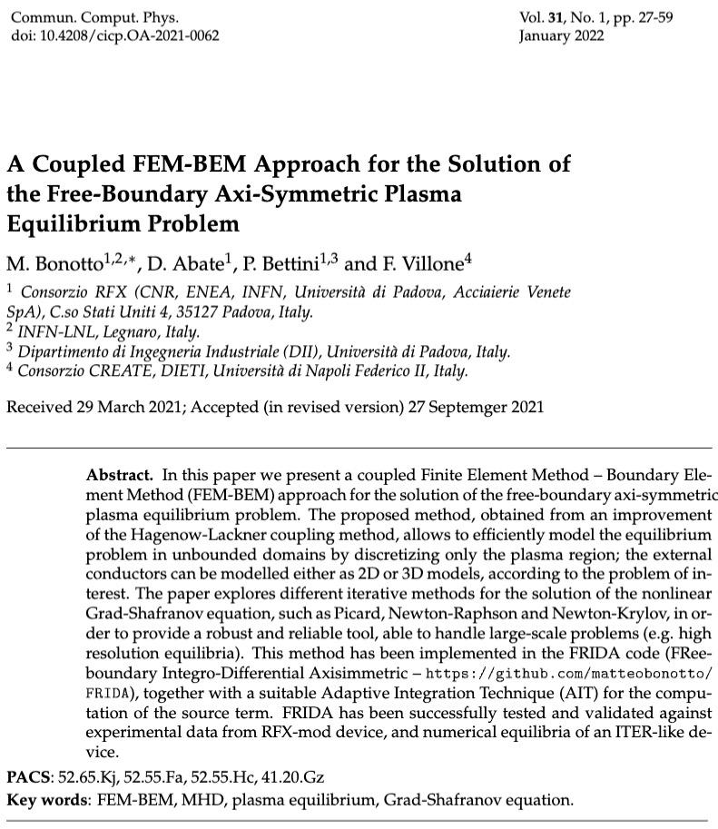

# A Coupled FEM-BEM Approach for the Solution of the Free-Boundary Axi-Symmetric Plasma Equilibrium Problem #paper

This is a *very long* paper
I'm not ready to read this paper yet, requirements:
- very good FEM methods knowledge #todo #fem
- good plasma physics knowledge, in particular grad-shafranov eq #todo #gse #plasma_physics
## Introduction
- Equilibrium codes are useful for:
	- design of tokamaks
	- scenario performance prediction
	- **design of feedback control schemes** 
	- MHD stability analysis

## Key Takeaways
- it heavily uses [CarMa0NL](../phd/CarMa0NL.md) to validate the results
 
## To Understand
- [ ] difference between fixed-boundary and free-boundary in equilibrium reconstruction
- [ ] Hagenow-Lackner (HL) coupling method #fem
- [ ] [CarMa0NL](../phd/CarMa0NL.md) code