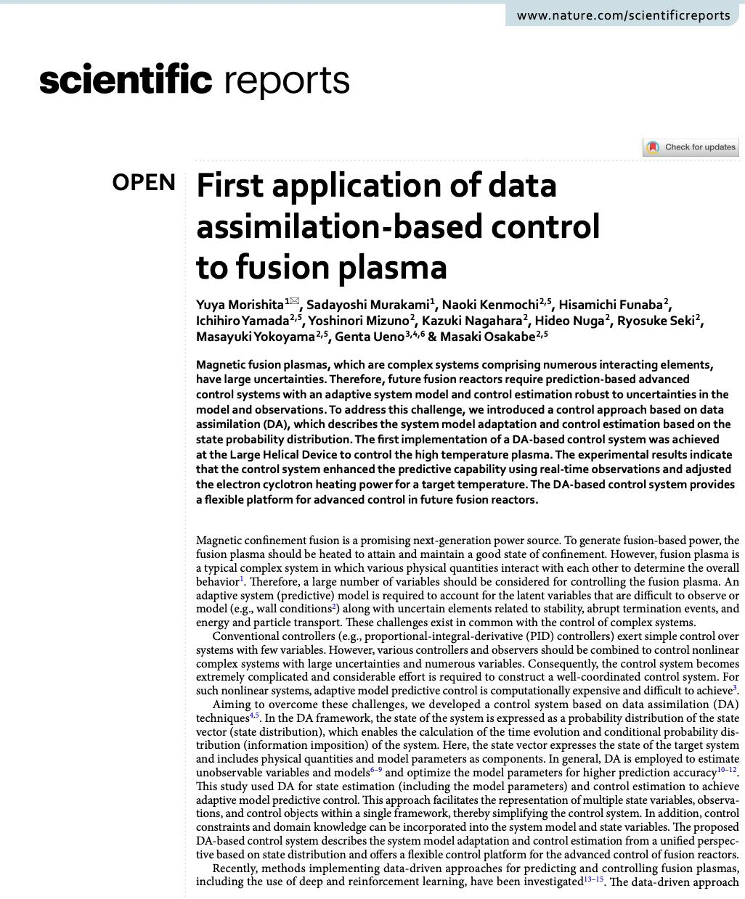

# First application of data assimilation‐based control to fusion plasma #paper

## Main idea

## Takeaways
From a quick read:
- The idea is to use a digital twin to control the temperature of the plasma inside the vessel using electron cyclotron heating (ECH)
- They **didn't** use neural networks
- They used a combination of various kalman filters (maybe particle filters too, not clear), and powerful simulation tools to get real-time approximated plasma parameters
- For the implementation they managed to connect several computers together, splitting the load of the many computationally expensive tasks
- They kinda use a monte carlo-ish approach to computation by computing various possible simulations depending on the distribution, 2 per core
- They managed to control, but achieved mixed results in the estimation capabilities: good in some phases, kinda bad in others and in transitions