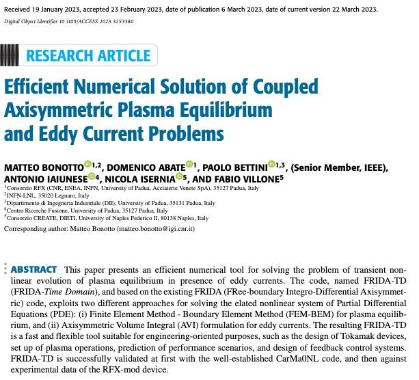

# Efficient Numerical Solution of Coupled Axisymmetric Plasma Equilibrium and Eddy Current Problems

This is a followup paper to the FRIDA paper [coupled_fem_bem_axi_symmetric_plasma_equilibrium](coupled_fem_bem_axi_symmetric_plasma_equilibrium.md), it extends [FRIDA](../phd/FRIDA.md) to the time domain by considering the equilibrium evolution in time, it considers the influence of eddy currents.

## To understand #todo 
- same as in the FRIDA paper, I need to better understand #fem
- There is a lot of (hard) math to go through #plasma_physics

## Key takeaways
- validated against [CarMa0NL](../phd/CarMa0NL.md)
- also validated against actual RFX-mod tokamak mode shot: 36922
  > FRIDA-TD cannot deal with instabilities in the plasma, and should add a control scheme for the vertical instability
	- [ ] include controller design into FRIDA-TD code
- the appendix of the paper appears to be very useful for better understanding the math stuff