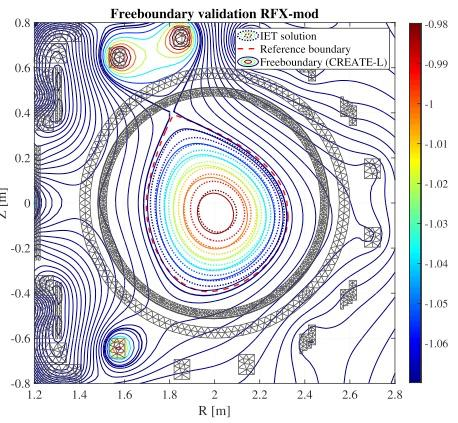

# An inverse equilibrium tool to define axisymmetric plasma equilibria #paper

## Intro
- coded in matlab
- calculates the coil currents needed to generate a predefined plasma shape
- input: plasma shape, total plasma current, total poloidal magnetic flux at the boundary
- solves a constrained optimization problem
- used to generate the characterization of a given plasma boundary
- works for both tokamak and rfp configurations
- solves for both single or multi-objective optimization
- shape can be characterized by means of a compact analytical functional form
	- this functional form can be generated using a matlab ui tool, the ui seems easy to use
	  
- fixed boundary
## Remarks\
- like [efficient_numerical_solution_axisymmetric_plasma_eddy_currents](efficient_numerical_solution_axisymmetric_plasma_eddy_currents.md) and [coupled_fem_bem_axi_symmetric_plasma_equilibrium](coupled_fem_bem_axi_symmetric_plasma_equilibrium.md) ([FRIDA](../phd/FRIDA.md)) it uses the Green matrix in the calculations
- it uses the Grad-Shafranov equation #gse 
- it uses Picard iterative scheme #fem 
- using different "norms" leads to very different results in the optimization
- optimality is "subjective" and depends on the designer preferences, there will be conflicting objectives
- this tradeoff can be expressed as a combination of the RMSE and the MAPE, the value $\lambda$ used to define the weight of each term can help to define a Pareto frontier
- it basically decides how well it will fit the desired plasma shape, well meaning a particular type of norm
- They used the free boundary [CREATE-L](../phd/CREATE-L.md) to validate the results
  
## To understand
- The mathematical formulation is not easy. Requires better knowledge of #fem