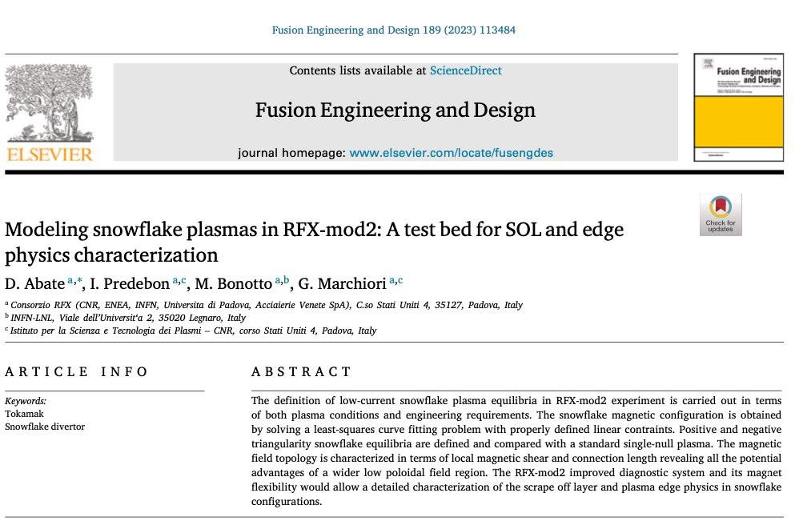

# Modeling snowflake plasmas in RFX-mod2: A test bed for SOL and edge physics characterization

This needs to be reread when I have better understood how different plasma shapes actually differ from one another, rn I don't understand the physics deep enough. #todo
## Remarks #todo
- they used [IET](../phd/IET.md) 
- snowflake is a very delicate and precise equilibrium
- snowflake is better than x-diverted for a variety of reasons
- tbc