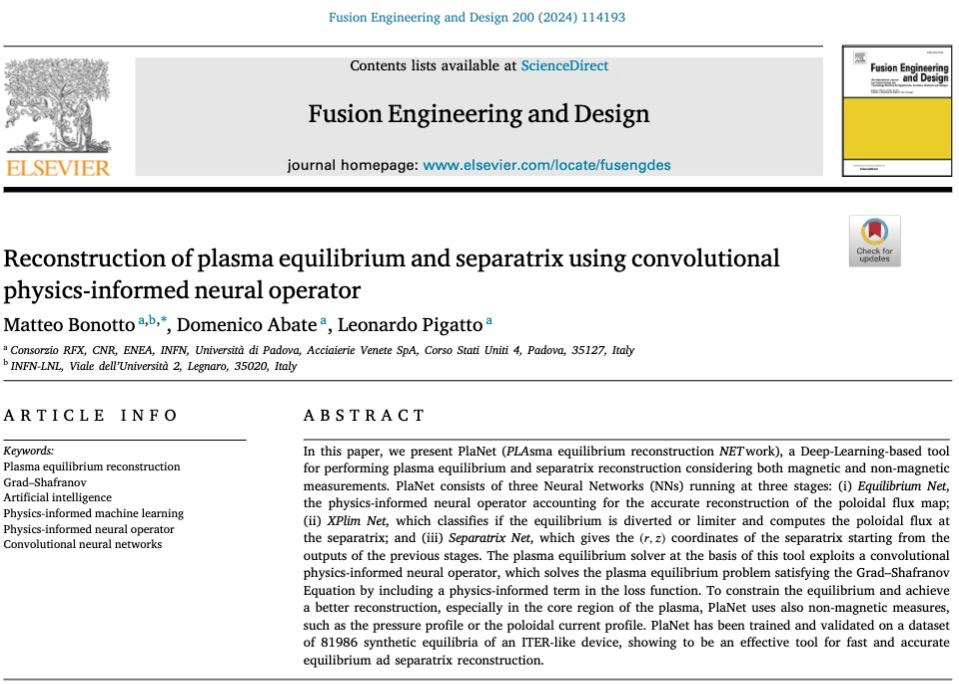
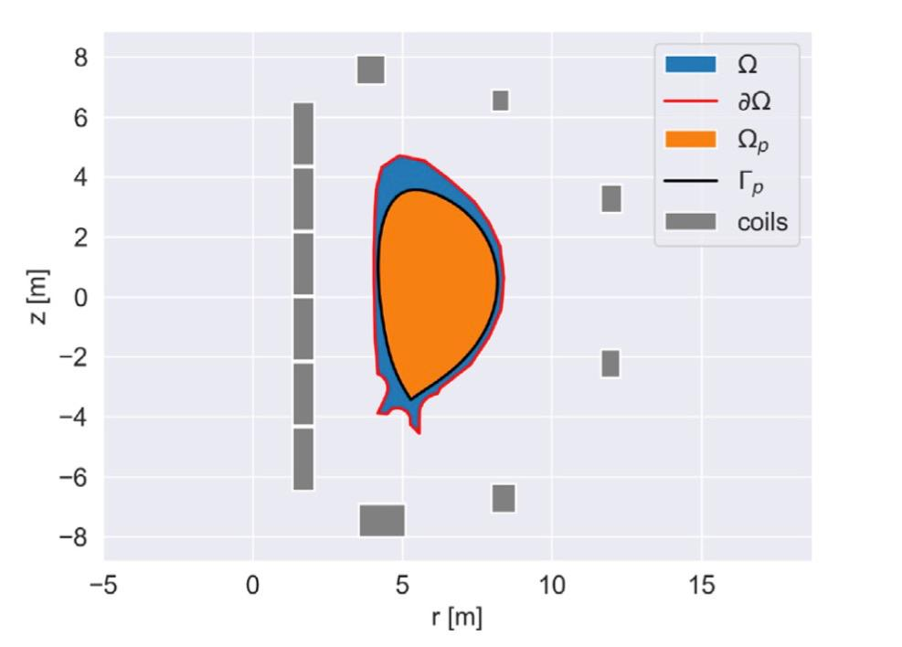

# Reconstruction of plasma equilibrium and separatrix using convolutional physics-informed neural operator

- This is about plasma equilibrium and separatrix reconstruction. The idea is to do what [FRIDA](../phd/FRIDA.md) does but faster, using 3 concatenated neural networks
- They called it PLANET
## Intro
- plasma equilibrium reconstruction is slow, because they are inherently sequential
- magnetic diagnostics are not enough to reconstruct the plasma, mostly in the core region, they are for the surface of the plasma
- To improve the estimation capabilities in the core, they use also non-magnetic measures, like the pressure profile and the poloidal current profile, being obtainable in realtime.
## Mathematical formulation of the plasma equilibrium problem

We consider the problem in cylindrical coordinate system: $(r,\phi,z)$  
$\Omega$ is the computational region, $\partial \Omega$ is the computational boundary.
$\Omega_p$ and $\Gamma_p$ are the plasma region and separatrix.
We need to solve the Free-Boundary Plasma Equilibrium Problem ( #FBPEP), described by #GSE with a boundary conditions BCs.

$$
-\;\nabla\cdot\left(\frac{1}{r}\nabla\psi(\vec{r})\right)=\left\{\begin{array}{l l}{{\mu_{0}j_{\phi}(\vec{r},\psi)}}&{{\quad\mathrm{if~}r\in\Omega_{p}}}\\ {{0}}&{{\quad\mathrm{elsewhere}}}\end{array}\right. 
$$
$$
\psi(\vec{r})\Big|_{\partial\Omega}=\hat{\psi}_{p}(\vec{r},\psi)+\hat{\psi}_{e x t}(\vec{r})
$$
With the current density being:
$$
j_{\phi}(\vec{r},\psi)=r\frac{d p(\vec{\psi})}{d\bar{\psi}}+\frac{f(\bar{\psi})}{\mu_{0}r}\frac{d f(\bar{\psi})}{d\bar{\psi}}
$$   with 
#tbc : Understand #GSE before