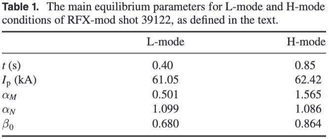

# Positive and negative triangularity in RFX-mod2: a comparative analysis #paper

- this is like a deep dive into Positive Triangularity (PT) and Negative Triangularity (NT)
- This is very related to [rfx_mod2_equilibria_demo_shape_negative](rfx_mod2_equilibria_demo_shape_negative.md) , meaning they both use [IET](../phd/IET.md) and [CREATE-L](../phd/CREATE-L.md), PT and NT are already addressed there too
- rfx-mod shot 39122 for examples of PT-L and PT-L
  
  
- They added [FRIDA](../phd/FRIDA.md) for the free boundary characterization
- #todo For electrostatic instabilities they used GENE and CHEASE code
## Interesting stuff
- "NT plasmas in L-mode are claimed to have energy confinement properties comparable to PT plasmas in H-mode" (H-mode has higher confinement than L-mode (by definition), so this means NT is way better for confinement) 
- DIII-D and TCV already dealt with NT scenarios
- in both machines, the global improvement in L-mode confinement is ascribed to a partial stabilization of trapped-electron-modes (TEMs) in NT
- lower growth rates and transport levels in NT than PT
- probably more interesting stuff in the second part 
## To understand #todo
- global $\beta$-limit
- low-n ballooning modes
- $\beta_N$ 
- transport (deep)
- gyrokinetic studies
- poloidal beta $\beta_P$ 
- safety factor $q_0$ 
- The whole second part of the paper requires more knowledge in [plasma_physics](../plasma_physics.md) 