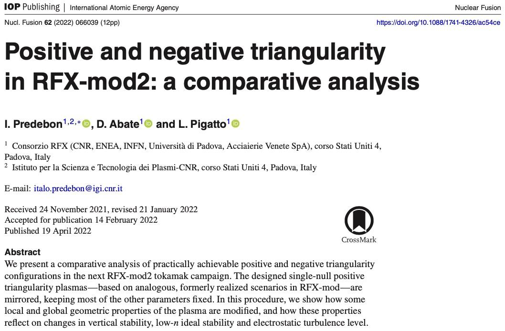

# Positive and negative triangularity in RFX-mod2: a comparative analysis

- this is like a deep dive into Positive Triangularity (PT) and Negative Triangularity (NT)
- This is very related to [rfx_mod2_equilibria_demo_shape_negative](rfx_mod2_equilibria_demo_shape_negative.md) , meaning they both use [IET](../phd/IET.md) and [CREATE-L](../phd/CREATE-L.md), PT and NT are already addressed there too
- 