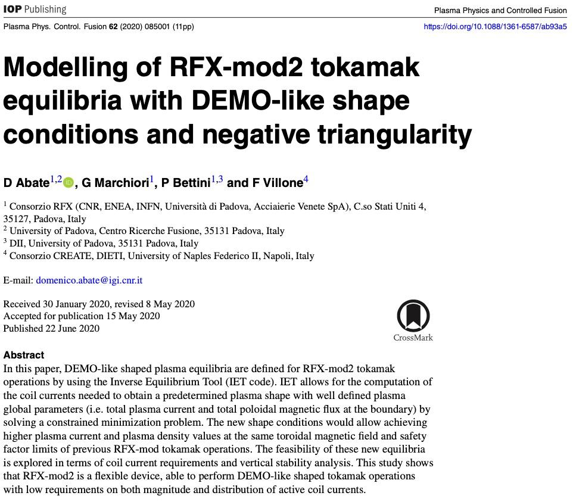

# Modelling of RFX-mod2 tokamak equilibria with DEMO-like shape conditions and negative triangularity

- They used 2 interesting numerical tools:
	- **Inverse Equilibrium Tool (IET)** ([github](https://github.com/DA2412/IET_Inverse_Equilibrium_Tool) ): it's a tool to calculate the coils currents needed to obtain a predetermined plasma shape, with well defined total plasma current #plasma_current, total poloidal magnetic flux at the boundary #poloidal_magnetic_flux and plasma current density profile #plasma_current_density.
		- [ ] implement IET in python
	- **CREATE-L** is a simple+reliable linearized plasma response model, used to control plasma current #plasma_current, position #plasma_position, and shape #plasma_shape
- They tested some DEMO-like shapes in RFX-mod2 
- TBC