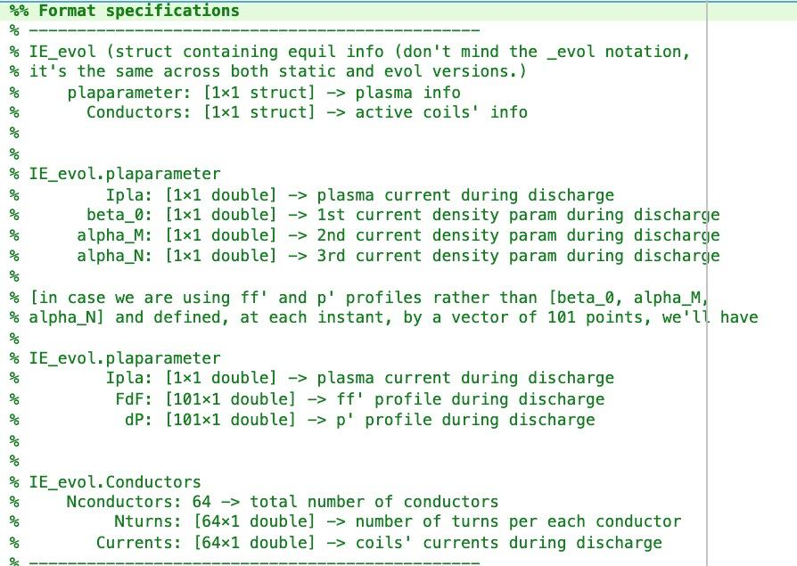

# FRee-boundary Integro-Differential Axisimmetric
code: https://github.com/matteobonotto/FRIDA
paper: [coupled_fem_bem_axi_symmetric_plasma_equilibrium](../papers/coupled_fem_bem_axi_symmetric_plasma_equilibrium.md)

## Notes for running the repo
- 23/08/24: not all necessary data is in the repo, the other required actions are: 
  -  get the data.zip and extract it in the root of the repo, there is another data.zip inside that needs to be extracted

## Code
FRIDA is structured in 3 steps: 
1) input geometry preparation: meshes, conductors, plasma region must be defined. This is very complex and I really don't want to touch it, I'll use the rfx-mod2 version which is already hardcoded; an iter version is also already present.
2) FRIDA input preparation:  this is the "documentation": 
3) actual free boundary equilibrium calculation