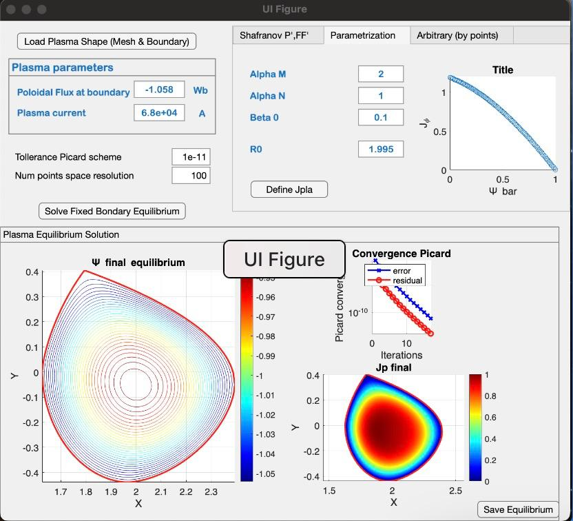

# IET Inverse equilibrium tool
https://github.com/DA2412/IET_Inverse_Equilibrium_Tool
- [ ] implement IET in python (maybe not needed)

## How to use IET
There is a guide in the repo, runtime is not needed. It says to use r2020a, I used r2024a and it worked except for the equilibrium section where there is a version bug, it's an easy fix-> ```.cla -> cla()```
I will ask for a pull request, I also compiled the  ```.mex``` files for mac arm64.
For the installation, nothing is needed (I think, because I tried a lot of stuff before), just open the repo in matlab and run the 3 ```.mlapp``` apps. Check terminal for errors. 
1) ```IET_code/IET_SHAPING_TOOL/IET_SHAPING_TOOL_App.mlapp```
2) ```IET_code/IET_EQUILIBRIUM_TOOL/IET_EQUILIBRIUM_TOOL_App.mlapp```
3) ```IET_code/IET_OPTIMIZATION_TOOL/IET_OPTIMIZATION_TOOL_App.mlapp```
The tool is very sensitive to the order of the operations. So follow the guide carefully.
Proofs:




