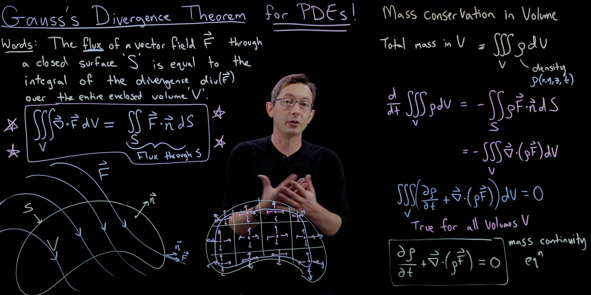

# Gauss Divergence Theorem #gdth

The flux of a vector field $\vec{F}$ through a closed surface $S$ is equal to the volume integral of the divergence of the vector field over the region enclosed by the surface.

$$
\iiint_V \nabla \cdot \vec{F} \, dV = \iint_S \vec{F} \cdot d\vec{S} 
$$

where $\vec{F}$ is a vector field, $d\vec{S}$ is the outward-pointing normal vector to the surface $S$, and $dV$ is the volume element.

> https://www.youtube.com/watch?v=TORt20_HjMY&ab_channel=SteveBrunton

> continuity is key for #gdth to work. If there are waves things change.

> #gdth is related to the conservation of momentum. 

# Stokes' Theorem #sth

The circulation of a vector field $\vec{F}$ around a closed curve $C$ is equal to the surface integral of the curl of the vector field over the surface enclosed by the curve.

$$
\iint_S (\nabla \times \vec{F}) \cdot d\vec{S} = \oint_{\partial S} \vec{F} \cdot d\vec{s}
$$

where $\vec{F}$ is a vector field, $d\vec{s}$ is the tangent vector to the curve $\partial S$, and $d\vec{S}$ is the outward-pointing normal vector to the infinitesimal patch on the surface $S$.

> $\vec{F}$ is 2D

> #st is related to the conservation of angular momentum.
## Green's Theorem
Stokes' theorem on a flat surface.

$$
\iint_S (\nabla \times \vec{F}) \cdot d\vec{S} = \oint_{\partial S} \vec{F} \cdot d\vec{s} 
$$

> the dot product disappears because the normal vector is perpendicular to the surface. 

#tbc